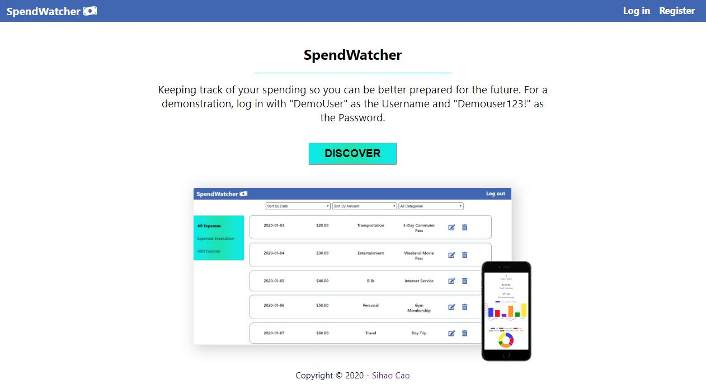

# SpendWatcher -- web application
* SpendWatcher allows anyone to track his or her expenditure information along with the ability to see a statistical breakdown for each expense category.

# App Description
* SpendWatcher is a full-stack web app built with React, CSS, Node, Express, and Postgresql. This website does not use any third-party API. This website is supported on Chrome, Firefox, and Safari. This app is a fully responsive website.

## Built with
* Node
* Express
* PostgreSQL

## Endpoints
### /users
* `POST /api/users`

Verifies input and adds a new user to the database if valid.

### /auth
* `POST /api/auth`

Verifies input and creates a token key for an existing user if valid.

### /expenses
* `GET /api/expenses`

Returns an array of expense entries.

* `GET /api/expenses/:expense_id`

Returns an expense entry whose id matches `:expense_id`.

* `POST /api/expenses`

Verifies input and adds a new expense entry to the database if valid.

* `PATCH /api/expenses/:expense_id`

Updates input of an existing expense entry if valid.

* `DELETE /api/expenses/:expense_id`

Deletes an expense entry from the database.

## Setting Up
* Install dependencies: `npm install`
* Create development and test databases: `createdb spendwatcher`, `createdb spendwatcher-test`
* Create database user: `createuser spendwatcher_user`
* Bootstrap development database: `spendwatcher npm run migrate`
* Bootstrap test database: `spendwatcher-test npm run migrate`

## Sample Data
* To seed the database for development: `psql -U spendwatcher_user -d spendwatcher -f seeds/seed.spendwatcher_tables.sql`

## Scripts
* Start application for development: `npm run dev`
* Run tests: `npm test`

## Authors
* Sihao Cao